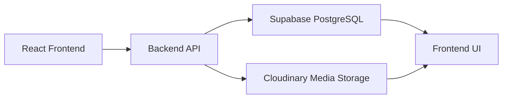

# Code Vimarsh Backend Workflow Report

## 1. Project Summary
This frontend expects a structured backend with authentication, content management, user profile handling, event registrations, and media uploads. The backend is built around Supabase PostgreSQL for relational data and Cloudinary for image storage.

## 2. Frontend Modules Mapped to Backend
The current React app uses these major data domains:
- **Authentication**: sign up (PRN, Name, Email, Password), sign in (PRN, Password), session verification, user profile fetch.
- **User profile**: avatar upload, social links (GitHub, LinkedIn, LeetCode), role-based dashboard, gamification stats (XP, level).
- **Events**: list, create, edit, delete, and registration responses.
- **Projects**: list, create, expand details (long descriptions, features, gallery), delete.
- **Blogs**: list, create, update, publish/draft, slug-based detail pages.
- **Achievements**: manage and display on a timeline.
- **Resources**: YouTube videos and website resources with category filters.
- **Alumni**: graduation batch profiling, roadmap pathways, and company/domain directory.
- **Team members**: department/section grouped directory.
- **Contact form**: public inquiry submission and admin read panel.
- **Admin operations**: user role management, event form configuration builder, and registry lists.

## 3. Recommended Backend Architecture

### Core Stack
- **Frontend**: React + Vite
- **Backend API**: Node.js/Express or Supabase Edge Functions
- **Database**: Supabase PostgreSQL
- **File storage**: Cloudinary
- **Authentication**: Supabase Auth

### Flow
1. User interacts with the frontend.
2. Frontend calls the backend API with JSON or multipart form data.
3. Backend validates the request and authenticates the user.
4. Data is stored in Supabase PostgreSQL tables.
5. Images or avatars are uploaded to Cloudinary, and the returned secure URL is saved in the database.
6. Backend returns the response to the frontend.

## 4. Suggested API Contract

### Auth
- **POST /auth/register**
  - **Request Body**: `{ prn: string, name: string, email: string, password: string }`
  - **Note**: Frontend sends `name` for Full Name. The backend must save this to the `full_name` column in the database.
- **POST /auth/send-otp**
  - **Request Body**: `{ email: string }`
- **POST /auth/verify-otp**
  - **Request Body**: `{ email: string, code: string }`
- **POST /auth/login**
  - **Request Body**: `{ prn: string, password: string }`
  - **Response**: `{ success: boolean, token: string, user: User }`
  - **CRITICAL IMPLEMENTATION NOTE**: Frontend logs in with **PRN** and Password, not Email. Since Supabase Auth requires email, the backend must first query the `profiles` table to fetch the email associated with the submitted `prn`, and then authenticate using that email and password with Supabase Auth.
- **GET /auth/me**
  - **Response**: `{ success: boolean, user: User }`
  - **User response mapping**:
    - DB `full_name` -> JSON `name`
    - DB `avatar_url` -> JSON `avatar`

### Users / Profile
- **GET /users/me** - Get current user profile
- **PUT /users/:id**
  - **Request Body**: `{ github_url: string, linkedin_url: string, leetcode_url: string }`
- **PATCH /users/me/avatar**
  - **Upload avatar**: multipart/form-data with `avatar` field.
  - **Response**: `{ success: boolean, avatar_url: string }`

### Events
- **GET /events**
  - **Response**: `{ success: boolean, events: Event[] }`
  - **Response Mapping**:
    - DB `banner_image_url` -> JSON `image`
    - DB `topics` -> JSON `tags`
    - DB `max_participants` -> JSON `capacity`
    - DB `form_fields` -> JSON `formFields`
    - DB `is_published` -> JSON `isPublished`
- **GET /events/:id**
  - **Response**: `{ success: boolean, event: Event }` (same mappings as GET /events)
- **POST /events**
  - **Request Body**: `{ title, description, long_description, type, status, location, start_date, end_date, banner_image, images, topics, max_participants, form_fields, is_published }`
- **PUT /events/:id** - Same as POST
- **DELETE /events/:id**
- **GET /events/registrations**
  - **Response**: `{ success: boolean, registrations: Participant[] }` - Admins only
  - **Response Mapping**:
    - DB `id` -> JSON `id` (UUID Ticket ID)
    - DB `full_name` -> JSON `name`
    - DB `email` -> JSON `email`
    - DB `event_id` -> JSON `eventId`
    - DB `registered_at` -> JSON `registeredAt`
    - DB `status` -> JSON `status` ('registered' | 'attended')
    - DB `custom_answers` -> JSON `customAnswers`
    - DB `ticket_qr_url` -> JSON `ticketQrUrl` (optional)
    - DB `email_sent_at` -> JSON `emailSentAt` (optional)
- **POST /events/:id/register** (ADDED)
  - **Request Body**: `{ answers: Record<string, any> }`
  - **Response**: `{ success: boolean, registration: Participant }`
  - **Note**: Frontend sends dynamic form field responses under `answers`. The backend should perform the following workflow:
    1. Inspect the event's `form_fields` configuration, extract values matching "Full Name", "Email Address", and "WhatsApp Number" to populate database columns (`full_name`, `email`, `phone`), and store the full payload in the `custom_answers` JSONB column.
    2. Generate a unique registration UUID `id` (this acts as the Ticket ID).
    3. Generate a **QR Code image** containing this UUID string, upload the image to media storage (e.g. Supabase Storage / Cloudinary), and save the public link to the `ticket_qr_url` column.
    4. Dispatch a confirmation email to the candidate via **SMTP (Code Vimarsh)** attaching/embedding the generated QR code image and event ticket pass.
    5. Record the timestamp of successful dispatch in the `email_sent_at` column.
    6. Return the created `Participant` object including `id`, `ticketQrUrl`, and `emailSentAt`.
- **PATCH /events/registrations/:id/check-in** (NEW)
  - **Request Body**: `{ status: 'registered' | 'attended' }`
  - **Response**: `{ success: boolean, registration: Participant }`
  - **Note**: Allows manual checking in or undoing checking in of a registrant from the Admin registration list.
- **POST /events/check-in** (NEW)
  - **Request Body**: `{ registration_id: string }`
  - **Response**: `{ success: boolean, message: string, registration: Participant }`
  - **Note**: Decodes scanned QR code payloads (which contain the registration ID) and updates the matching registration's status from `'registered'` to `'attended'`.

### Projects
- **GET /projects**
  - **Response**: `{ success: boolean, data: Project[] }`
  - **Category mapping**:
    - DB `'Web'` -> JSON `'Web'`
    - DB `'App'` -> JSON `'Mobile'`
    - DB `'AI'` -> JSON `'AI / ML'`
    - DB `'Other'` -> JSON `'Systems'`
  - **Field mappings**:
    - DB `tech_stack` -> JSON `tech`
    - DB `author_name` -> JSON `author`
    - DB `github_link` -> JSON `links.github`
    - DB `live_link` -> JSON `links.live`
    - DB `image_url` -> JSON `image`
    - DB `images` -> JSON `images` (Gallery)
- **POST /projects**
  - **Request Body**: `{ title, short_description, full_description, features[], category, tech_stack[], github_link, live_link, image, images[] }`
- **DELETE /projects/:id**

### Team
- **GET /team**
  - **Response**: `{ success: boolean, data: TeamMember[] }`
  - **Mappings**:
    - DB `github_url` -> JSON `github`
    - DB `linkedin_url` -> JSON `linkedin`
    - DB `image_url` -> JSON `image`
- **POST /team** - Add new member
- **PUT /team/:id** - Update member
- **DELETE /team/:id**

### Blogs
- **GET /blogs**
  - **Response**: `{ success: boolean, data: ManagedBlog[] }`
  - **Mappings**:
    - DB `short_description` -> JSON `shortDescription`
    - DB `featured_image_url` -> JSON `featuredImage`
    - DB `author_name` -> JSON `authorName`
    - DB `author_role` -> JSON `authorRole`
- **GET /blogs/:slug** - Response: `{ success: boolean, data: ManagedBlog }`
- **POST /blogs**
  - **Request Body**: `{ title, slug, topic, short_description, content, featured_image, images[], author_name, author_role, tags[], status }`
- **PUT /blogs/:id** - Same as POST
- **DELETE /blogs/:id**

### Achievements
- **GET /achievements**
  - **Response**: `{ success: boolean, data: ManagedAchievement[] }`
  - **Mappings**:
    - DB `sort_order` -> JSON `order`
- **POST /achievements**
- **PUT /achievements/:id**
- **DELETE /achievements/:id**

### Resources
- **GET /resources**
  - **Response**: `{ success: boolean, data: Resource[] }`
  - **Mappings**:
    - DB `best_for` -> JSON `bestFor`
    - DB `content_type` -> JSON `type` (and alias `contentType`)
    - DB `thumbnail_url` -> JSON `thumbnail`
- **POST /resources**
- **PUT /resources/:id**
- **DELETE /resources/:id**

### Alumni
- **GET /alumni**
  - **Response**: `{ success: boolean, data: Alum[] }`
  - **Note**: The alumni columns are aligned 1:1 with frontend keys (`role`, `linkedin`, `github`, `website`, `photo`, `roadmap` JSONB, etc.) so that CRUD payloads do not require translation.
- **POST /alumni**
- **PUT /alumni/:id**
- **DELETE /alumni/:id**

### Contact
- **POST /contact**
  - **Request Body**: `{ name, email, subject, message }`
- **GET /contact** - Retrieve messages (Admins only)

### Admin
- **GET /admin/users** - Response: `{ success: boolean, users: ClubMember[] }`
- **PATCH /admin/users/:id/role** - Request body: `{ role: string }`

---

## 5. Core Mapping Table

| Frontend Property | Database Column | Backend Mapping/Responsibility |
| --- | --- | --- |
| `User.name` | `profiles.full_name` | Rename in API serializer |
| `User.avatar` | `profiles.avatar_url` | Rename in API serializer |
| `User` login credentials | `profiles.email` lookup | Translate `prn` to `email` for Supabase Auth |
| `EventType.image` | `events.banner_image_url` | Rename in API serializer |
| `EventType.tags` | `events.topics` | Rename in API serializer |
| `EventType.capacity` | `events.max_participants` | Rename in API serializer |
| `EventType.formFields` | `events.form_fields` | Rename in API serializer |
| `ProjectType.tech` | `projects.tech_stack` | Rename in API serializer |
| `ProjectType.author` | `projects.author_name` | Rename in API serializer |
| `ProjectType.links.github` | `projects.github_link` | Nest/Flatten in API serializer |
| `ProjectType.links.live` | `projects.live_link` | Nest/Flatten in API serializer |
| `ProjectType.image` | `projects.image_url` | Rename in API serializer |
| `TeamMember.github` | `team_members.github_url` | Rename in API serializer |
| `TeamMember.linkedin` | `team_members.linkedin_url` | Rename in API serializer |
| `TeamMember.image` | `team_members.image_url` | Rename in API serializer |
| `ManagedBlog.shortDescription` | `blogs.short_description` | Rename in API serializer |
| `ManagedBlog.featuredImage` | `blogs.featured_image_url` | Rename in API serializer |
| `ManagedBlog.authorName` | `blogs.author_name` | Rename in API serializer |
| `ManagedBlog.authorRole` | `blogs.author_role` | Rename in API serializer |
| `ManagedAchievement.order` | `achievements.sort_order` | Rename in API serializer |
| `Resource.bestFor` | `resources.best_for` | Rename in API serializer |
| `Resource.type` | `resources.content_type` | Rename in API serializer |
| `Resource.thumbnail` | `resources.thumbnail_url` | Rename in API serializer |
| `Alum` | `alumni` properties | 1:1 Direct mapping (Aligned in Database) |
| `Participant.status` | `event_registrations.status` | 1:1 Direct mapping |
| `Participant.customAnswers` | `event_registrations.custom_answers` | Rename/Direct mapping in API serializer |
| `Participant.ticketQrUrl` | `event_registrations.ticket_qr_url` | Rename in API serializer |
| `Participant.emailSentAt` | `event_registrations.email_sent_at` | Rename/Timestamp mapping in API serializer |

## 6. Cloudinary Strategy
- Save images via the Cloudinary SDK on the backend.
- Retrieve the returned URL and store it in database fields ending in `_url` (or `photo`/`thumbnail`).
- Used for: profile avatars, event banner images, project preview/gallery images, team member profiles, alumni photos, and blog covers.

## 7. Implementation Roadmap
1. **Database Initialization**: Apply the SQL schema in Supabase.
2. **Setup Cloudinary Service**: Add file upload route helpers.
3. **Build API Auth Router**: Implement register (mapping name -> full_name) and login (looking up email from prn).
4. **Build Core Resources Routers**: Events, Projects, Blogs, Achievements, Team, Alumni, Resources. Make sure all API controllers perform serialization according to Section 5.
5. **Admin Panels Integration**: Complete roles management and forms builder endpoints.
6. **Form Response Router**: Implement `/events/:id/register` to capture custom inputs dynamically.
